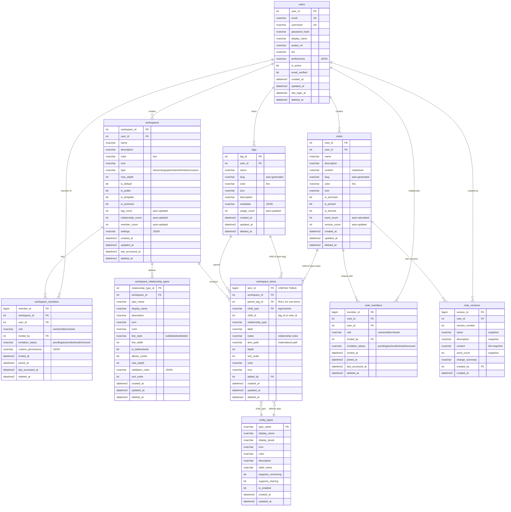

# Entity Relationship Diagram (Detailed)

**Database:** SuperApp-dev (MVP 1.0)
**Last Updated:** October 15, 2025

---

## 📊 Full ERD with Relationships



---

## 🔑 Key Relationships

### Core Flow
1. **User** creates **Workspaces** and **Tags**
2. **Workspace** has **Members** (sharing)
3. **Workspace** contains **Items** (tag-tag or tag-note relationships)
4. **User** creates **Notes** with **Members** and **Versions**

### UNIFIED workspace_items
- Parent can be **NULL for root items** or **tag** (`parent_tag_id`)
- Child can be **any entity** (`child_type` + `child_id`)
- Examples:
  - Root Tag "Work": `(parent_tag_id=NULL, child_type='tag', child_id=1, depth=0)`
  - Tag "Work" → Tag "Projects": `(parent_tag_id=1, child_type='tag', child_id=2, depth=1)`
  - Tag "Projects" → Note "Q1": `(parent_tag_id=2, child_type='note', child_id=5, depth=2)`

---

## 📝 Table Counts (Current MVP)

| Table | Rows | Status |
|-------|------|--------|
| users | 5 | ✅ Test data |
| tags | 9 | ✅ Test data |
| entity_types | 3 | ✅ Seeded (tag, note, + 3 disabled) |
| workspaces | 5 | ✅ Test data |
| workspace_members | 17 | ✅ Test data |
| workspace_relationship_types | 5 | ✅ Auto-created by trigger |
| workspace_items | 0 | ✅ Ready (no data yet) |
| notes | 12 | ✅ Test data |
| note_members | 12 | ✅ Auto-created by trigger |
| note_versions | 12 | ✅ Auto-created by trigger |

---

## 🎨 How to View

### Option 1: GitHub
- Upload this file to GitHub
- GitHub will auto-render Mermaid diagrams

### Option 2: VS Code
- Install "Markdown Preview Mermaid Support" extension
- Open this file and click "Open Preview"

### Option 3: Online
- Copy diagram to https://mermaid.live/
- Export as PNG/SVG

### Option 4: CLI
```bash
# Install mermaid-cli
npm install -g @mermaid-js/mermaid-cli

# Generate PNG
mmdc -i ERD-DIAGRAM.md -o ERD-DIAGRAM.png

# Generate SVG
mmdc -i ERD-DIAGRAM.md -o ERD-DIAGRAM.svg
```

---

**Note:** This diagram reflects the **ACTUAL deployed schema** (MVP 1.0), not the planned design.
