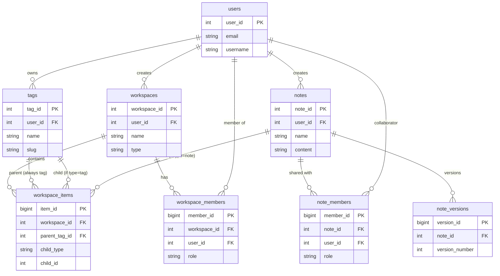

# Entity Relationship Diagram (Simplified)

**Database:** SuperApp-dev (MVP 1.0)
**Purpose:** Quick overview without field details

---

## 📊 Simple ERD (Overview)



---

## 🎯 Key Points

### Three Main Systems

1. **User & Tags**
   - Users own tags (global pool)
   - Tags used across workspaces

2. **Workspaces**
   - Users create workspaces
   - Workspaces shared with members (roles)
   - **workspace_items (UNIFIED)** organizes both tags and notes

3. **Notes**
   - Users create notes
   - Notes shared with members (roles)
   - Notes versioned automatically

---

## ⚠️ UNIFIED Design

**workspace_items** is the key table:
- **Parent:** Always a tag (`parent_tag_id`)
- **Child:** Can be tag OR note (`child_type` + `child_id`)

**Examples:**
```
Tag "Work" contains Tag "Projects"
├─ parent_tag_id: 1 (Work)
└─ child_type: 'tag', child_id: 2 (Projects)

Tag "Projects" contains Note "Q1 Report"
├─ parent_tag_id: 2 (Projects)
└─ child_type: 'note', child_id: 5 (Q1 Report)
```

---

## 📊 Statistics

- **10 tables** deployed
- **15 procedures** (CRUD operations)
- **8 triggers** (auto-generation, stats updates)
- **~35 indexes** (performance optimization)

---

**For detailed field-level ERD:** See [ERD-DIAGRAM.md](ERD-DIAGRAM.md)
